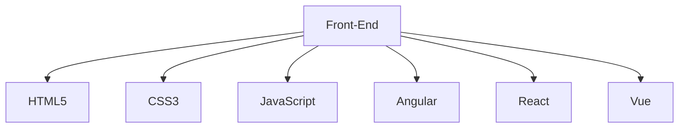

 


 # Desarollado Web Front-End

I am a Junior Front-End Developer with solid experience in HTML, CSS, JavaScript, and React. My focus is on creating intuitive and appealing interfaces to provide an excellent user experience. Passionate about continuous learning and ready to tackle challenges in dynamic teams.


 
<!--------------------------------------------------------------------------------------------------------------------------------------------------------->

<h1 align="center">Github Metrics </h1><p align="center">


<!--------------------------------------------------------------------------------------------------------------------------------------------------------->


<div align="center">  
   
  
  
</div> 

<!--------------------------------------------------------------------------------------------------------------------------------------------------------->

<p align="center">
 

<!--------------------------------------------------------------------------------------------------------------------------------------------------------->

<div align="center">
<div align="center">
<a href="https://www.facebook.com/diegosuarez97/" target="_blank"></a>
<a href="https://portafolio-diego-suarez.netlify.app/" target="_blank"></a>

[](https://www.linkedin.com/in/diego-suarez-tafur-a04465170/)
[](suarezdiego297@gmail.com)
</div>

<!--------------------------------------------------------------------------------------------------------------------------------------------------------->


<!--------------------------------------------------------------------------------------------------------------------------------------------------------->

 ```geojson
{
  "type": "FeatureCollection",
  "features": [
    {
      "type": "Feature",
      "id": 1,
      "properties": {
        "ID": 0
      },
      "geometry": {
        "type": "Polygon",
        "coordinates": [
          [
[-74.879654, 4.146141],
[-74.864733, 4.158297],
[-74.899711, 4.144662]
          ]
        ]
      }
    }
  ]
}
 ```
<!--------------------------------------------------------------------------------------------------------------------------------------------------------->


